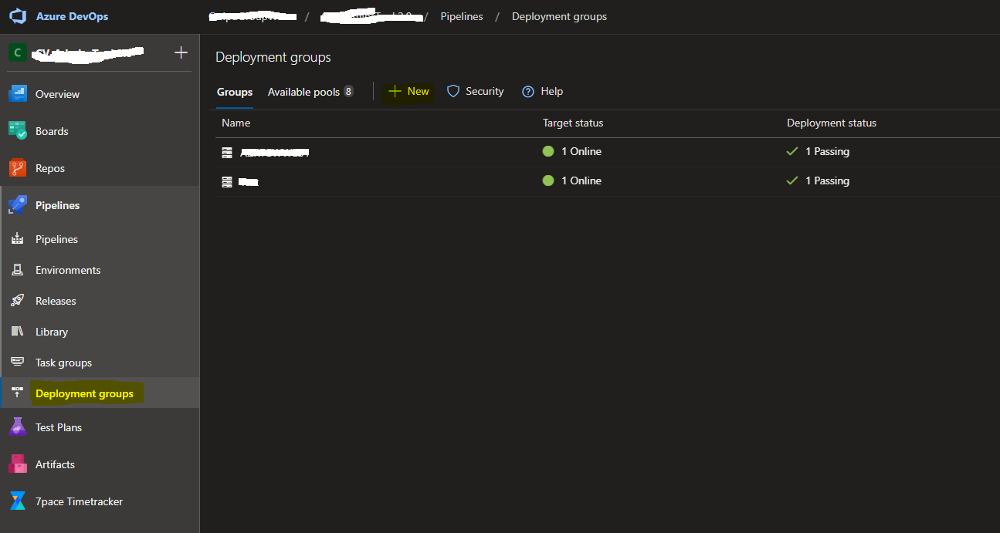
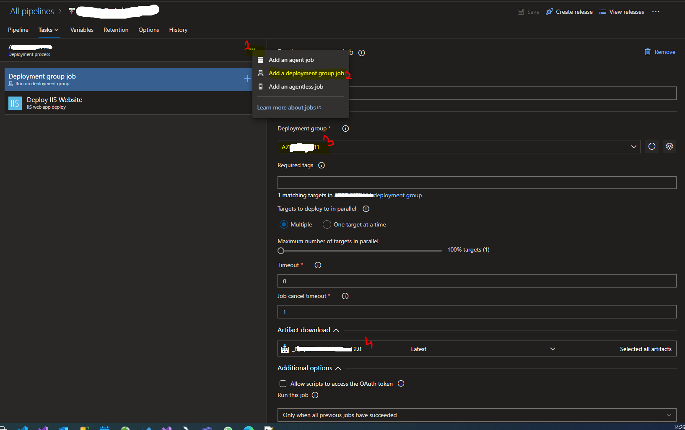

# Deploy to IIS

To read more about Azure pipeline [task](https://docs.microsoft.com/en-us/azure/devops/pipelines/tasks/?view=azure-devops) and [template](https://github.com/microsoft/azure-pipelines-yaml)

## .Net 5 Web app

We need to follow two steps

  Step 1: Create build pipeline with yml or clasic (UI) in Azure  
  Step 2: Create release pipeline

Step 1: Create YAML file

```yml
# ASP.NET Core (.NET Framework)
# Build and test ASP.NET Core projects targeting the full .NET Framework.
# Add steps that publish symbols, save build artifacts, and more:
# https://docs.microsoft.com/azure/devops/pipelines/languages/dotnet-core

trigger: none

pool:
  vmImage: 'windows-latest'

variables:
  solution: '**/*.sln'
  buildPlatform: 'Any CPU'
  buildConfiguration: 'Release'

steps:
- task: NuGetToolInstaller@1

- task: NuGetCommand@2
  inputs:
    restoreSolution: '$(solution)'

# Publish will build first, we don't need build command
- task: DotNetCoreCLI@2
  inputs:
    command: publish
    publishWebProjects: True
    arguments: '--configuration $(BuildConfiguration) --output $(Build.ArtifactStagingDirectory)'
    zipAfterPublish: True

- task: PublishBuildArtifacts@1
  inputs:
    PathtoPublish: '$(Build.ArtifactStagingDirectory)'
    ArtifactName: 'drop'
```

Read more about yml file for [.Net 5](https://docs.microsoft.com/azure/devops/pipelines/languages/dotnet-core) [here](https://docs.microsoft.com/en-us/azure/devops/pipelines/apps/cd/deploy-webdeploy-iis-deploygroups?view=azure-devops)

Step 2: Create release pipeline

* Create Deployment Group

1. Go to Deployment group -> New 

2. Copy the Script and run in virtual machine command line tool (Administrator) 

* Create release pipline

1. Go to Release -> New -> Start with 'Empty job'

2. Artiface, select azure artifact

3. Remove all the job from Stage, or what ervet the name

4. Select 'Add deployment group job', follow the picture 

5. Select 'Deploy IIS', follow picture 

## .Net Framework

We need to follow two steps

  Step 1: Create build pipeline with yml or clasic (UI) in Azure  
  Step 2: Create release pipeline

Step 1: Create YAML file

```yml
# ASP.NET
# Build and test ASP.NET projects.
# Add steps that publish symbols, save build artifacts, deploy, and more:
# https://docs.microsoft.com/azure/devops/pipelines/apps/aspnet/build-aspnet-4

trigger: none

pool:
  vmImage: 'windows-latest'

variables:
  solution: '**/*.sln'
  buildPlatform: 'Any CPU'
  buildConfiguration: 'Release'

steps:
# - task: UseDotNet@2
#   inputs:
#     version: '4.x'

- task: NuGetToolInstaller@0
  displayName: 'Use NuGet 4.0.0'
  inputs:
    versionSpec: 4.0.0

- task: NuGetCommand@2
  displayName: 'NuGet restore'
  inputs:
    restoreSolution: '$(solution)'

- task: VSBuild@1
  displayName: 'Build solution'
  inputs:
    solution: '$(solution)'
    msbuildArgs: '/p:DeployOnBuild=true /p:WebPublishMethod=Package /p:PackageAsSingleFile=true /p:SkipInvalidConfigurations=true /p:PackageLocation="$(build.artifactStagingDirectory)"'
    platform: '$(buildPlatform)'
    configuration: '$(buildConfiguration)'

- task: PublishBuildArtifacts@1
  displayName: 'Publish Artifact'
  inputs:
    PathtoPublish: '$(build.artifactstagingdirectory)'
    ArtifactName: 'drop'
  condition: succeededOrFailed()
```

Step 2: Create release pipeline

Folow the .Net 5 procedure
