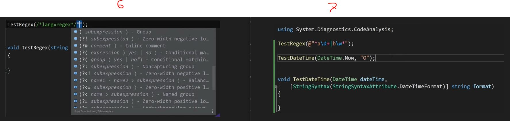

# C# Knowledge

## Inherits List/IList  

```C#
public class MyListClass : System.Collections.Generic.List<string>
{
    public IEnumerable<string> this[string prifix, params int[] keys] => keys.Select(key=> this[key] + " " + prifix);
}

[TestMethod]
public void MyMethod()
{
    var myList = new MyListClass { "Mofaggol", "Hoshen" };

    var bla = myList["Developer", 0, 1];

    foreach (var item in bla)
    {
        Debug.WriteLine(item);
    }
}
```

## CustomValidationAttribute Sample

```C#
[TestClass]
public class CustomValidationAttributeTest
{
[TestMethod]
    public void CustomAttributeTest()
    {
        var attribute = new CustomValidationAttribute(typeof(CustomValidationAttributeTest), "Validator");
        int model = 10;

        var isValid = attribute.IsValid(model);
        var result = attribute.GetValidationResult(model, new ValidationContext(model));
    }

    public static ValidationResult Validator(object value, ValidationContext context)
    {
        //Validation logic
        if (value is int i && i > 0)
            return ValidationResult.Success!;
        else
            return new ValidationResult("");
    }

[TestMethod]
 public void Test_Int_Range_0_To_1()
    {
        var attribute = new RangeAttribute(0, 1) { ErrorMessage = "PropertyName: {0}, MinValue: {1}, MaxValue: {2}" };

        int model = 2;
        var isValid = attribute.IsValid(model);
        var result = attribute.GetValidationResult(model, new ValidationContext(model));
            
    }
}


 
```

## Web Server(TestServer with Localhost)

```C#
public class HttpBase
    {
        public HttpClient HttpClient { get; private set; }
        public TestServer TestServer { get; set; }

        public HttpBase()
        {
            // Arrange
            TestServer = new TestServer(new WebHostBuilder()
                .ConfigureAppConfiguration((hostingContext, config) =>
                {
                    config.AddJsonFile("appsettings.Test.json", optional: true, reloadOnChange: true);
                    config.AddJsonFile("appsettings.Development.json", optional: true, reloadOnChange: true);
                })
               .UseStartup<Startup>());
            HttpClient = TestServer.CreateClient();
            HttpClient.BaseAddress = new Uri(@"https://localhost:44303/api/");
            HttpClient.DefaultRequestHeaders.Add("key", "Value");
            HttpClient.DefaultRequestHeaders.Add("api-version", "1.0");
        }

    }

[TestClass]
public class PersonTest : HttpBase
    {
        [TestMethod]
        public async Task GetPersonDetails()
        {
            var response = await HttpClient.GetAsync("persons/10001");
            var resStr = await response.Content.ReadAsStringAsync();
           // Person person = await response.Content.ReadFromJsonAsync<Person>();
        }
    }
```

## DI with console

```C#
/*
 * NuGet Packages
 * Microsoft.Extensions.Configuration
 * Microsoft.Extensions.Configuration.Json
 * Microsoft.Extensions.Logging
 */
private ServiceProvider ServiceCollections()
{
   var Configuration = new ConfigurationBuilder()
                    .AddJsonFile("appsettings.Env.json", optional: true, reloadOnChange: true)
                    .AddEnvironmentVariables()
                   // .AddCommandLine(args)
                    .Build();


    var serviceProvider = new ServiceCollection()
           .AddTransient<TwOneService>()
           .AddScoped<StartupService>()
           .AddSingleton<IConfiguration>(Configuration)
           //.AddHttpContextAccessor()
          .AddTransient<IHttpContextAccessor>((sp) =>
           {
               IHttpContextAccessor httpContextAccessor = new HttpContextAccessor();
               httpContextAccessor.HttpContext = new DefaultHttpContext();
               httpContextAccessor.HttpContext.Request.Headers.Add("key", "BlaBla");
               return httpContextAccessor;
           })
          //.AddHttpClient()
           .AddLogging()
           .BuildServiceProvider();

    return serviceProvider;
}
```

Read more about DI container [here](https://stackoverflow.com/questions/62489732/blazor-which-is-better-inject-or-cascading-value/62502222#62502222)

## Dropdownlist (DDL) with AJAX Call

```JavaScript
<script type="text/javascript">

$(document).ready(function () {

   $("#jBranch").on("change", function () {
          
     var selectedVlue = $(this).val();
     if(selectedVlue)
         {
           $.ajax({
           url: ROOT +"branch/"+ id,
           type: 'GET',
           dataType: "json",
           success: function(results)
                       {
                             var options = '<option>@SharedLocalizer["PleaseSelectText"]</option>';
                             $.each(results, function(i, result)
                              {
                                var option = '<option value="'+result.id+'"';

                                if(@Model.DepartmentId === result.id)
                                         option += 'selected="selected"';

                                    option +='>'+ result.name+'</option>';

                                 options += option;
                                });
                            $("#jDt").html(options);
                        }
                    }); 
            }else{
                var options = '<option>@SharedLocalizer["PleaseSelectText"]</option>';
                $("#jDt").html(options);
            }
    });
});

</script>
```

## Cancel Runing Task

```C#
using static System.Console;
var source = new Cancellation TokenSource();
var token = source. Token;
Task.Run(async () {
    while (true) {
    WriteLine("cool");
    var wait = TimeSpan. FromSeconds (1);
    await Task.Delay (wait, token);
    }
}, token);

ReadKey();
// stop running the task
source. Cancel();
WriteLine("Cancelled!");
ReadKey();
```

## Value type validation

With required attribute, Property needs to be nullable for example

```C#
    [required]
    public int? Id {set; get;}
```

On the other hand, if property is not nullable value type always be 0 in API, json serializer do it outof the box.

## Copy File (External Package XML Doc) to Specific Directory Using Copy Task in csproj

```XML
  <Target Name="CopyDocumentationFiles" BeforeTargets="Build">
    <ItemGroup>
      <DocumentationFiles Include="%(Reference.RelativeDir)/Abc.One.API.*.xml" />
    </ItemGroup>

    <Copy SourceFiles="@(DocumentationFiles)" DestinationFolder="$(OutputPath)" />
  </Target>
```

Copy to publish for use $(PublishDir).

In azure build pipeline it's not working, not copying file to destination folder so use Copy File task -

```YML
- task: CopyFiles@2
  displayName: 'Copy XML for swagger'
  inputs:
    SourceFolder: '$(UserProfile)\.nuget\packages'
    Contents: '**\*ABC.CDF.API.AddOns*.xml'
    TargetFolder: '$(build.artifactstagingdirectory)'
```

I was copying XML documentation file for swagger, Copy File task will copy files with folder structure so we need to read all XML documentation files from sub folders while settingup/injecting swagger

```C#
builder.Services.AddSwaggerGen(c =>
{
    c.SwaggerDoc("v1",
        new OpenApiInfo
        {
            Title = "CardOnlineMaintenance",
            Version = "v1"
        }
     );

    //var xmlFilename = $"{Assembly.GetExecutingAssembly().GetName().Name}.xml";
    //c.IncludeXmlComments(Path.Combine(AppContext.BaseDirectory, xmlFilename));

    List<string> xmlFiles = Directory.GetFiles(AppContext.BaseDirectory, "ABC.DEF.API.*.xml", SearchOption.AllDirectories).ToList();
    xmlFiles.ForEach(xmlFile => c.IncludeXmlComments(xmlFile));
});
```

## String Syntax Attribute in .NET 7



This from vscode  

## Custom Tag in .csproj

```XML
<PropertyGroup>
    <TargetFramework>net6.0</TargetFramework>
    <Nullable>enable</Nullable>
    <ImplicitUsings>enable</ImplicitUsings>
    <Version>1.0.1</Version>
    <VersionDate>2023-01-27</VersionDate>
</PropertyGroup>
<ItemGroup>
    <AssemblyAttribute Include="Abc.Efg.API.Helper.VersionDateAttribute">
      <_Parameter1>$(VersionDate)</_Parameter1>
    </AssemblyAttribute>
 </ItemGroup>
```

```C#

// Attribute to read date from .csproj
namespace Abc.Efg.API.Helper
{
    [System.AttributeUsage(System.AttributeTargets.Assembly, Inherited = false, AllowMultiple = false)]
    sealed class VersionDateAttribute : System.Attribute
    {
        public DateTime Date { get; }
        public VersionDateAttribute(string versionDate)
        {
            if(DateTime.TryParse(versionDate, out DateTime date))
                Date = date;
        }
    }
}

// Reading values using System.Reflection
public void GetVersion()
    {
        var version = Assembly.GetEntryAssembly()?.GetCustomAttribute<AssemblyInformationalVersionAttribute>()?.InformationalVersion;
        
        DateTime versionDate = DateTime.MinValue;

        if (Assembly.GetEntryAssembly()?.GetCustomAttribute<VersionDateAttribute>() is VersionDateAttribute versionAtt)
            versionDate = versionAtt.Date;
    }

```
